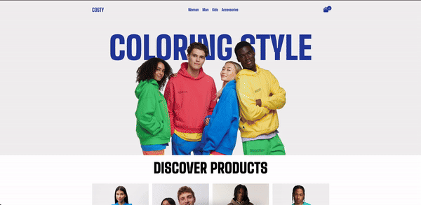

# 🛒 E-Commerce Website

## 📋 **Project Introduction**
-This e-commerce site is a dynamic web application designed to quickly and efficiently meet customers' needs. It provides a user-friendly interface and responsive design for optimal performance on all devices. Products are dynamically retrieved from a JSON file and feature persistent data storage via LocalStorage.

## 🔧 **Technologies Used**
- **HTML5**: For creating structured and semantic content.
- **CSS3**: For modern and responsive design to enhance user experience.
- **JavaScript (ES6+)**: For adding dynamic and interactive features.
- **LocalStorage**: For persistent user data storage.
- **JSON**: For dynamic product data management.
- **Git & GitHub**: For version control and team collaboration.

## 🎯 **Project Objectives**
1. **User Experience**: Provide a simple, fast, and user-friendly shopping experience.
2. **Data Storage**: Securely store user cart and product information.
3. **Dynamic Content**: Manage and display product data dynamically using JSON.
4. **Responsive Design**: Ensure seamless performance and appearance across all devices.
5. **Easy Management**: Facilitate easy addition and management of products.

## ⚙️ **Project Dynamics**
- **🏠 Home Page**: A page where products are listed and can be added to the cart.
- **🛒 Cart Page**: A page where added products are displayed and managed.
- **🔄 Dynamic Product Retrieval**: Fetch products dynamically from a JSON file.
- **🗃️ Data Persistence**: Preserve user data using LocalStorage.
- **📱 Mobile Compatibility**: Ensure excellent compatibility across different devices.

## 💻 **Usage**
- **View Products**: Browse and add products to the cart on the home page.
- **Manage Cart**: View, edit, or remove products in the cart on the cart page.

## 🤝 **Contribution**
-To contribute, please open an issue first. Fork the repository, make your changes, and submit a pull request.

## 🎥 **Short GIF** 
Here is a short GIF demonstrating the main features of the site:

